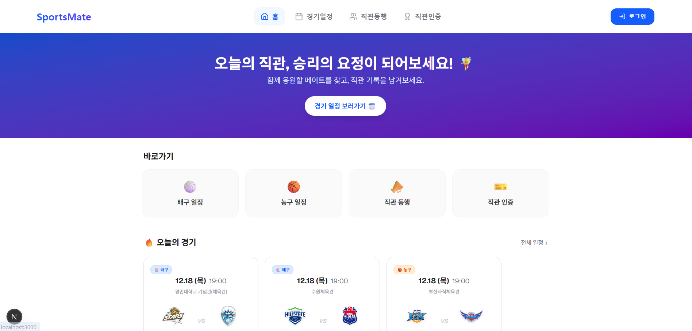
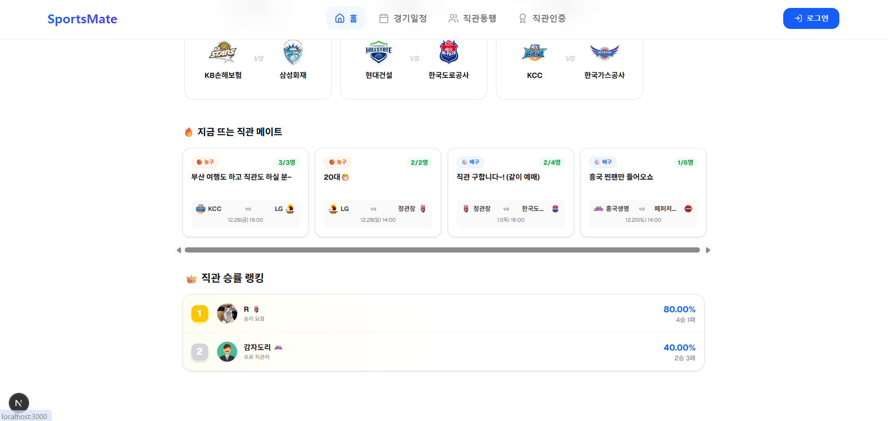
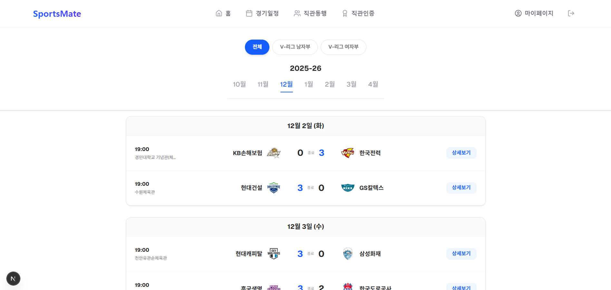
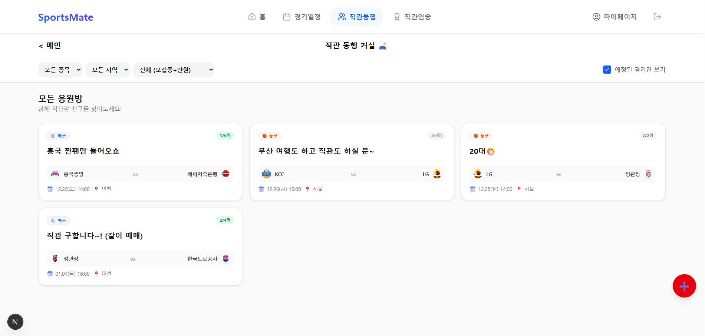
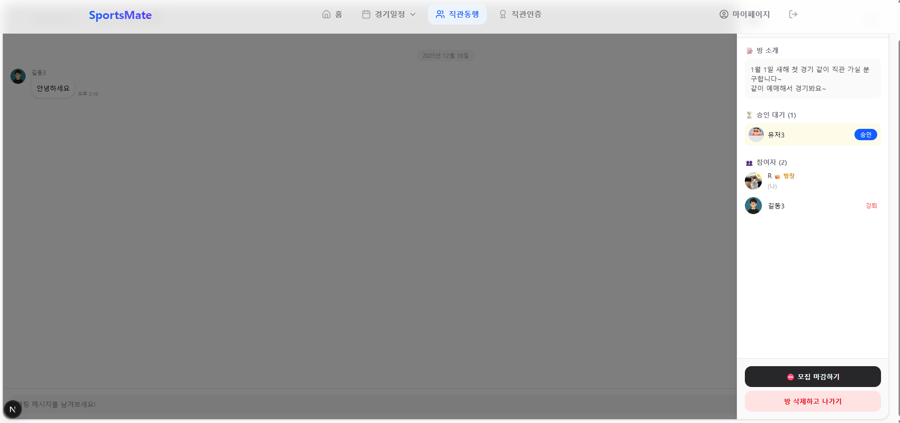
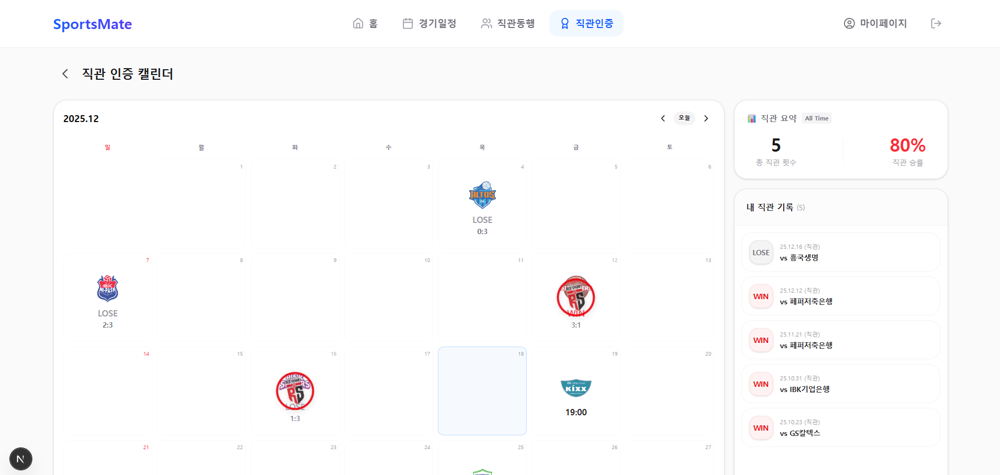
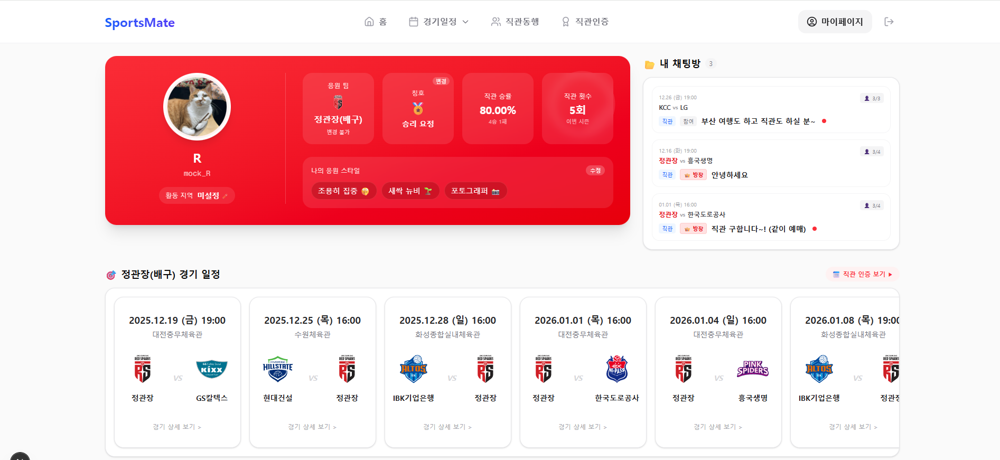
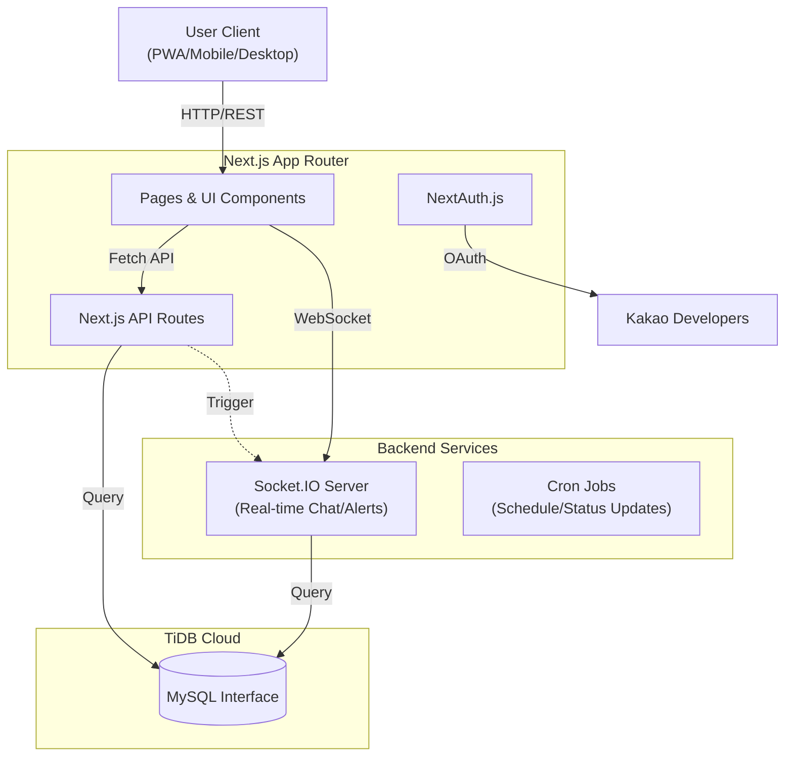

# 🏐 SportsMate

<div align="center">


</div>

> **배구/농구 직관을 함께! 완벽한 직관 메이트 매칭 플랫폼**

SportsMate는 V-League(배구)와 KBL/WKBL(농구) 팬들을 위한 올인원 직관 동행 플랫폼입니다.
경기 일정 확인부터 직관 메이트 찾기, 실시간 응원톡, 그리고 나만의 직관 기록까지 —
모든 직관 경험을 하나의 앱에서 완성하세요!

---

## 📸 주요 기능 미리보기

|                                              메인 홈 1 (Feed)                                              |                                     메인 홈 2 (Schedule)                                      |
| :--------------------------------------------------------------------------------------------------------: | :-------------------------------------------------------------------------------------------: |
| <br><sub>오늘의 인기 경기와 실시간 핫한 직관 모임을 한눈에 확인</sub> | <br><sub>종목별/날짜별 경기 일정을 직관적으로 탐색</sub> |

|                                       경기 일정 (Schedule)                                       |                                     직관 동행 찾기 (Rooms)                                     |
| :----------------------------------------------------------------------------------------------: | :--------------------------------------------------------------------------------------------: |
| <br><sub>실시간 점수 확인 및 지난 경기 결과 조회</sub> | <br><sub>지역/팀 필터링으로 딱 맞는 직관 메이트 찾기</sub> |

|                                      실시간 채팅 (Chat)                                      |                                    직관 인증 (Cert)                                     |
| :------------------------------------------------------------------------------------------: | :-------------------------------------------------------------------------------------: |
| <br><sub>Socket.IO 기반의 실시간 응원 및 시스템 알림</sub> | <br><sub>직관 사진 업로드 및 관리자 승인 시스템</sub> |

|                                  마이페이지 (Profile)                                   |     |
| :-------------------------------------------------------------------------------------: | :-: |
| <br><sub>나의 직관 승률 분석 및 활동 배지 관리</sub> |     |

> _※ 이미지는 `public/demo` 폴더에 넣어주세요._

---

## ✨ 주요 기능

### 📅 **경기 일정 관리**

- **실시간 경기 일정**: V-League(남자부/여자부) 및 KBL/WKBL 경기 일정을 실시간으로 확인
- **팀별 필터링**: 내가 응원하는 팀의 경기만 한눈에 보기
- **경기 상세 정보**: 일시, 장소, 팀 엠블럼, 경기 결과 등 모든 정보 제공

### 🤝 **직관 동행 매칭**

- **스마트 필터링**: 종목(배구/농구), 지역, 모집 상태별 검색
- **방 생성 & 참여**: 원하는 경기에 직관방을 만들거나 기존 방에 참여
- **승인 시스템**: 방장의 승인으로 안전하고 신뢰할 수 있는 매칭
- **실시간 알림**: 참여 신청, 승인 상태를 즉시 확인

### 💬 **실시간 응원톡**

- **공식 응원 채팅**: 모든 경기마다 제공되는 공식 응원톡방
- **자동 입장**: 로그인 시 즉시 참여 가능 (승인 불필요)
- **프라이빗 채팅**: 직관 동행방 전용 채팅으로 메이트와 소통
- **Socket.IO 기반**: 끊김 없는 실시간 메시징 경험

### 🏅 **직관 인증 & 캘린더**

- **직관 기록 관리**: 참석한 경기를 캘린더에 기록
- **사진 인증**: 직관 현장 사진으로 추억을 저장
- **승률 통계**: 내가 간 경기의 승/패 기록 자동 계산
- **칭호 시스템**: 직관 횟수와 승률에 따른 특별 칭호 획득

### 👤 **마이페이지**

- **프로필 커스터마이징**: 아바타, 응원 팀, 활동 지역 설정
- **응원 스타일**: 나만의 직관 스타일 태그 선택 (최대 3개)
- **내 채팅방 관리**: 참여 중인 모든 방을 한눈에 확인
- **팀 일정 보기**: 응원 팀의 다가오는 경기 일정 한눈에

### 📱 **PWA 지원**

- **모바일 앱처럼**: 홈 화면에 추가하여 네이티브 앱처럼 사용
- **오프라인 지원**: 서비스 워커로 안정적인 경험 제공
- **반응형 디자인**: 데스크톱, 태블릿, 모바일 모든 환경에서 최적화

---

## 🛠️ 기술 스택

### Frontend

- **Framework**: [Next.js 15](https://nextjs.org/) (App Router)
- **Language**: TypeScript
- **Styling**: Tailwind CSS
- **State Management**: Zustand
- **Icons**: Lucide React
- **Date Handling**: date-fns

### Backend

- **API**: Next.js API Routes
- **Authentication**: NextAuth.js (Kakao OAuth)
- **Real-time**: Socket.IO
- **Database**: MySQL (with mysql2)
- **ORM/Query Builder**: Raw SQL

### DevOps & Tools

- **PWA**: @ducanh2912/next-pwa
- **Image Handling**: Next.js Image Optimization
- **File Upload**: Multer (서버 측)

### Deployment: Vercel (Frontend), Custom Server (Socket.IO)

---

## 🏗️ 시스템 아키텍처



---

## 🚀 시작하기

### 사전 요구사항

- **Node.js** 18.17 이상
- **npm** 또는 **yarn**
- **MySQL** 8.0 이상
- **Kakao Developers** 앱 등록 (OAuth 인증용)

### 설치 및 실행

1. **저장소 클론**

   ```bash
   git clone https://github.com/your-username/sports-mate.git
   cd sports-mate
   ```

2. **의존성 설치**

   ```bash
   npm install
   ```

3. **환경 변수 설정**

   `.env.local` 파일을 프로젝트 루트에 생성하고 다음 내용을 입력하세요:

   ```env
   # Database
   DB_HOST=localhost
   DB_USER=your_db_user
   DB_PASSWORD=your_db_password
   DB_NAME=sports_mate

   # NextAuth
   NEXTAUTH_URL=http://localhost:3000
   NEXTAUTH_SECRET=your-secret-key-here

   # Kakao OAuth
   KAKAO_CLIENT_ID=your_kakao_client_id
   KAKAO_CLIENT_SECRET=your_kakao_client_secret

   # Socket.IO Server (if running separately)
   SOCKET_SERVER_URL=http://localhost:4000
   ```

4. **데이터베이스 스키마 생성**

   `db/schema.sql` 파일의 SQL을 실행하여 테이블을 생성하세요.

5. **개발 서버 실행**

   ```bash
   # Next.js 개발 서버
   npm run dev

   # Socket.IO 서버 (별도 터미널)
   npm run socket
   ```

6. **브라우저에서 확인**

   [http://localhost:3000](http://localhost:3000)을 열어 앱을 확인하세요!

---

## 📁 프로젝트 구조

```
sports-mate/
├── public/              # 정적 파일 (이미지, 아이콘, manifest.json)
├── src/
│   ├── app/            # Next.js App Router 페이지
│   │   ├── api/        # API Routes
│   │   ├── rooms/      # 직관 동행 페이지
│   │   ├── schedule/   # 경기 일정 페이지
│   │   ├── certification/ # 직관 인증 페이지
│   │   └── profile/    # 마이페이지
│   ├── components/     # 재사용 가능한 컴포넌트
│   │   ├── match/      # 경기 관련 컴포넌트 (CheeringChat 등)
│   │   └── user/       # 사용자 관련 컴포넌트
│   ├── lib/            # 유틸리티 & 상수
│   ├── services/       # 비즈니스 로직 (Service Layer)
│   ├── store/          # Zustand 스토어
│   └── types/          # TypeScript 타입 정의
├── socket-server/      # Socket.IO 서버
├── db/                 # 데이터베이스 스키마 & 마이그레이션
└── README.md
```

---

## 🔥 트러블 슈팅 (Troubleshooting)

### 1. TiDB 클라우드 연결 초과 문제 (Too Many Connections)

- **문제**: 개발 중 빈번하게 `Too many connections` 에러 발생하며 DB 접속 불가.
- **원인**: Serverless 환경(Next.js)에서 API 요청마다 새로운 DB 연결을 생성하여 TiDB 무료 티어의 연결 제한(50개)을 초과함.
- **해결**: `mysql2/promise`의 **Connection Pool**을 최적화.
  - `connectionLimit: 10`으로 제한하여 풀 사이즈 고정.
  - `maxIdle`, `idleTimeout` 설정을 추가하여 유휴 연결을 적극적으로 해제.
  - 전역(Global) 변수에 Pool 인스턴스를 캐싱하여 Hot Reload 시에도 연결 재사용 유도.

### 2. Next.js와 Socket.IO의 통합 아키텍처

- **문제**: Next.js (App Router)는 기본적으로 서버리스 함수로 동작하여, 지속적인 연결이 필요한 WebSocket 서버를 내장하기 어려움.
- **해결**: **Custom Socket Server 분리 전략** 채택.
  - `src/socket-server.ts`로 별도의 Node.js 프로세스를 실행하여 소켓 통신 전담.
  - 프론트엔드(Next.js)와 백엔드(Socket Server)가 DB를 공유하며 데이터 일관성 유지.
  - 배포 시 Vercel(웹) + Render(소켓) 하이브리드 배포 구조 설계.

---

## 🚀 CI/CD 파이프라인 (Automated Deployment)

### GitHub Actions & Vercel Integration

- **Frontend (Vercel)**: GitHub `main` 브랜치 Push 시 Vercel이 자동으로 감지하여 빌드 및 배포.
- **Backend (Render)**: Socket.IO Server는 Render 웹 서비스와 연동되어 코드 변경 시 자동 재배포.
- **Environment Management**: `.env` 환경 변수를 각 플랫폼에서 안전하게 관리하여 보안성 강화.

---

<div align="center">
  
### 🏐 SportsMate와 함께 즐거운 직관 되세요! 🏀

**Made with ❤️ by Sports Fans, for Sports Fans**

</div>
